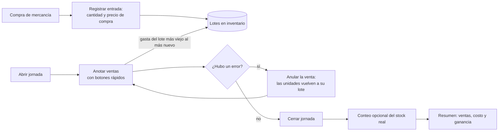

# Inventario Pool — La lógica del negocio

Este documento explica **qué hace la app y por qué funciona así**, antes de escribir una sola línea de código. Léelo completo. Si algo no te cuadra, pregunta antes de programar: es mejor corregir una idea aquí que corregir código después.

El plan técnico (datos, interfaces, fases y reparto de trabajo) está en [`docs/PLAN_TECNICO.md`](docs/PLAN_TECNICO.md).

---

## 1. El negocio en un minuto

Es un bar con mesas de pool en Colombia. Se vende cerveza (de varias marcas), chitos, cigarros, agua y otras cosas, y también se cobra el juego de pool.

La app la usa **una sola persona en la caja, desde el celular**, **sin internet**. Durante la noche las ventas se van anotando (en el cuaderno o tocando botones) y en la app se registran para llevar el control.

El dueño quiere responder dos preguntas, y nada más:

1. **¿Cuánto tengo de cada cosa?** (inventario)
2. **¿Cuánto estoy ganando?** (dinero)

Todo lo demás (fiado, deudas, sueldos) lo sigue llevando en el cuaderno.

---

## 2. Las cinco ideas que sostienen todo

1. **El inventario es continuo.** No se reinicia por fecha ni por día. Lo que hay hoy es lo que había ayer, más lo que entró, menos lo que se vendió. Solo cambia cuando alguien registra algo o corrige algo.
2. **La mercancía entra en lotes.** Cada vez que se compra, se registra cuántas unidades llegaron y **a cuánto se compró cada una**. Esa compra es un *lote*.
3. **El precio de venta lo decide el dueño** y lo escribe en cada producto. Nada se calcula solo.
4. **Se vende primero lo más viejo.** Cada venta gasta los lotes en orden: del más antiguo al más nuevo. Así la ganancia sale del costo real de cada botella y no de un promedio.
5. **La noche es solo una etiqueta.** Una *jornada* se abre y se cierra a mano. Sirve para agrupar las ventas de una noche y calcular cuánto se ganó. No reinicia nada.

---

## 3. Glosario

| Palabra | Qué significa |
|---|---|
| **Producto** | Algo que se vende. Tiene nombre, categoría y precio de venta. |
| **Categoría** | Para agrupar productos (Cervezas, Snacks, Cigarros, Juegos…). |
| **Lote** | Una compra de un producto: cantidad, precio de compra por unidad y fecha. |
| **Stock** | Cuántas unidades quedan de un producto, sumando lo que le queda a cada lote. |
| **Venta** | Una o varias unidades de un producto, al precio que tenía en ese momento. |
| **Jornada** | Una noche de trabajo, abierta y cerrada a mano por el dueño. |
| **Margen** | Qué parte del precio es ganancia. Se muestra de dos formas (ver sección 4). |
| **Conteo** | Contar físicamente cuánto queda y compararlo con lo que dice la app. |
| **Ajuste** | La corrección que se guarda cuando el conteo no coincide con la app. |
| **Gasto** | Plata que sale del negocio y no es mercancía (hielo, luz, arriendo…). |

---

## 4. Un ejemplo completo: la cerveza Águila

Esta es la historia que explica casi toda la lógica. El precio de venta de la Águila es **6.000**.

**Paso 1: primera compra.** Se compran 24 Águila a **5.000** cada una.

| Lote | Unidades | Compra |
|---|---|---|
| 1 | 24 | 5.000 |

**Paso 2: el proveedor baja el precio.** Se compran otras 24, ahora a **4.300**.

| Lote | Unidades | Compra |
|---|---|---|
| 1 | 24 | 5.000 |
| 2 | 24 | 4.300 |

Ahora hay 48 en stock, pero **no todas costaron lo mismo**.

**Paso 3: se venden 30.** La app gasta primero el lote 1 y luego el 2:

| De dónde salen | Unidades | Ganancia por unidad | Ganancia |
|---|---|---|---|
| Lote 1 (a 5.000) | 24 | 6.000 − 5.000 = 1.000 | 24.000 |
| Lote 2 (a 4.300) | 6 | 6.000 − 4.300 = 1.700 | 10.200 |
| **Total** | **30** | | **34.200** |

**Paso 4: qué se aprende.** Si todas las 30 se hubieran comprado al precio nuevo, la ganancia habría sido 30 × 1.700 = **51.000**. La diferencia es **16.800**: es lo que el dueño "dejó de ganar" por haber comprado antes más caro. Esa comparación es justo lo que quiere ver en la pantalla de márgenes.

**Los márgenes de cada lote** (con el precio de venta actual, 6.000):

| Lote | Ganancia por unidad | Margen sobre venta | Margen sobre costo |
|---|---|---|---|
| 1 (a 5.000) | 1.000 | 16,7 % | 20,0 % |
| 2 (a 4.300) | 1.700 | 28,3 % | 39,5 % |

- **Margen sobre venta** = ganancia ÷ precio de venta. "De cada 6.000 que entran, el 28,3 % es ganancia."
- **Margen sobre costo** = ganancia ÷ precio de compra. "Sobre lo que pagué, gano 39,5 %."

El dueño quiere ver **los dos**.

---

## 5. El pool: sin lógica especial

En el pool la cerveza sale a 8.000 (7.000 de la cerveza y 1.000 del juego) y jugar solo cuesta 2.000. Para no tener reglas sueltas ni combos, **no hay nada especial**. Cada cosa es simplemente un producto con su propio precio, que escribe el dueño:

| Producto | Precio | ¿Lleva inventario? | Ganancia (con costo de 4.300) |
|---|---|---|---|
| Cerveza Águila | 7.000 | Sí | 2.700 |
| Cerveza Águila Pool | 8.000 | Sí | 3.700 |
| Juego Pool | 2.000 | **No** | 2.000 |

Consecuencias que hay que tener claras:

- "Cerveza Águila" y "Cerveza Águila Pool" son **dos productos distintos, con su propio stock y sus propios lotes**. Cuando llegue mercancía, el dueño decide en cuál de los dos la registra.
- Un producto **sin inventario** (como el juego) se puede vender siempre, no gasta lotes y su costo es 0. Toda su venta es ganancia.
- Si mañana quiere otro juego (billar, rana…), solo crea un producto nuevo sin inventario y le pone nombre y precio.

---

## 6. Una noche, paso a paso

1. **Abrir la jornada.** El dueño la abre cuando empieza la noche. Si un día no abre (por ejemplo martes y miércoles), simplemente no abre nada. No hay un corte automático a medianoche, así que una noche puede cruzar de un día al otro sin problema.
2. **Anotar las ventas.** Hay una cuadrícula de botones por categoría. Un toque suma 1 unidad. Si son varias, se escribe la cantidad. Cada venta descuenta del inventario y guarda **el precio de ese momento**.
3. **Corregir errores.** Si algo se anotó mal, se **anula** la venta. No se borra: queda marcada como anulada y las unidades regresan exactamente a los lotes de donde salieron.
4. **Cerrar la jornada.** Al cerrar, la app muestra el resumen de la noche.
5. **Conteo (opcional).** Antes de cerrar, el dueño puede contar lo que realmente quedó (ver sección 7).

Solo se puede vender con una jornada abierta, y solo puede haber **una jornada abierta a la vez**. Si el dueño se equivocó al cerrar, puede **reabrir la última**.

### El resumen de la noche

Ejemplo con la venta de las 30 Águila, más un gasto:

| Concepto | Valor |
|---|---|
| Ventas (30 × 6.000) | 180.000 |
| Costo de lo vendido (24 × 5.000 + 6 × 4.300) | 145.800 |
| **Ganancia** | **34.200** |
| Gastos de la noche (hielo) | 20.000 |
| Ganancia menos gastos *(dato informativo)* | 14.200 |

**Los gastos se muestran aparte.** No cambian la ganancia de los productos, para que esa cifra siempre sea limpia. Un gasto es solo una anotación libre (concepto y monto), y la app suma el total.

---

## 7. El conteo al cerrar

Con el tiempo, lo que dice la app y lo que hay en la nevera pueden no coincidir. El conteo sirve para detectarlo.

- **Esperado:** lo que la app cree que queda.
- **Contado:** lo que el dueño cuenta con sus manos.
- **Diferencia:** contado − esperado.

Ejemplo: después de vender las 30 Águila, la app espera **18** botellas (todas del lote 2). Se cuentan **16**. La diferencia es **−2**:

| Cómo se mide la pérdida | Valor |
|---|---|
| Al costo (2 × 4.300) | 8.600 |
| Al precio de venta (2 × 6.000) | 12.000 |

Qué hace la app:

- **Si falta:** descuenta esas unidades del inventario, también del lote más viejo, y deja la corrección anotada.
- **Si sobra:** agrega las unidades como un lote nuevo con el precio de compra del lote más reciente.
- **No se le cobra a nadie.** Esta app no maneja empleados ni descuentos. Solo mantiene el inventario honesto.

El conteo es **opcional**: si el dueño no cuenta, no pasa nada.

---

## 8. Cómo se cuida la plata

Hay reglas que nunca se rompen, porque aquí un error significa dinero mal contado:

- **Los montos son pesos enteros.** Nunca decimales. Ni 4.300,5 ni centavos.
- **El precio de la venta se guarda en la venta.** Si el dueño sube la Águila de 6.000 a 6.500, las ventas viejas siguen en 6.000.
- **Los productos no se borran, se archivan.** Así el historial nunca queda sin su producto.
- **Anular no es borrar.** La venta queda marcada y las unidades vuelven a su lote original.
- **No se puede vender más de lo que hay.** Si el stock no alcanza, la app avisa y pide registrar primero la entrada que falta.
- **Cada cambio queda anotado.** Anular o editar guarda qué había antes y qué hay después.
- **Todo o nada.** Una venta toca varias cosas a la vez (la venta, los lotes, el stock). Si algo falla a la mitad, no se guarda nada.
- **La hora es la de Colombia** (`America/Bogota`), aunque por dentro se guarde en UTC.

---

## 9. Lo que la app NO hace (a propósito)

| No hace | Por qué |
|---|---|
| Fiado o "me deben" | En el bar se cobra de una. |
| Deudas del dueño ("le debo a…") | Se queda en el cuaderno. |
| Empleados ni descuentos por faltantes | El cliente pidió no complicar. La app es solo inventario y dinero. |
| Combos o reglas especiales de precio | Se resuelve con productos separados (sección 5). |
| Varios usuarios | Lo usa una sola persona. |

---

## 10. Decisiones tomadas y por qué

| Decisión | Razón |
|---|---|
| Se vende lo más viejo primero | Es lo que describió el dueño: quiere ver cuánto ganó con el precio viejo y cuánto habría ganado con el nuevo. |
| Jornada abierta y cerrada a mano | El dueño decide cuándo abre. Puede haber noches sin abrir y noches que pasan de medianoche. |
| El pool son productos separados | Para no tener lógica suelta. Todo precio lo escribe el dueño. |
| No se puede vender sin stock | Si se dejara, no se sabría de qué lote sale el costo. |
| Los gastos van aparte de la ganancia | La ganancia de productos debe quedar limpia. |
| El conteo no se cobra a nadie | Sin empleados, no hay a quién cobrarle. Solo corrige el inventario. |
| Todo funciona sin internet | Es para usar en el bar, en el celular. |

## 11. Preguntas abiertas para el cliente

1. ¿El margen principal que quiere ver es el de venta, el de costo o ambos? *(por ahora, ambos)*
2. ¿El conteo al cerrar debe ser obligatorio u opcional? *(por ahora, opcional)*
3. Si falta stock al vender, ¿se bloquea la venta o se deja pasar con una advertencia? *(por ahora, se bloquea)*

---

## 12. Dónde seguir

- Datos, interfaces, arquitectura, pruebas y fases: [`docs/PLAN_TECNICO.md`](docs/PLAN_TECNICO.md).
- Los ejemplos de este documento (Águila, pool, conteo) son los **casos de prueba** que la lógica debe cumplir.
