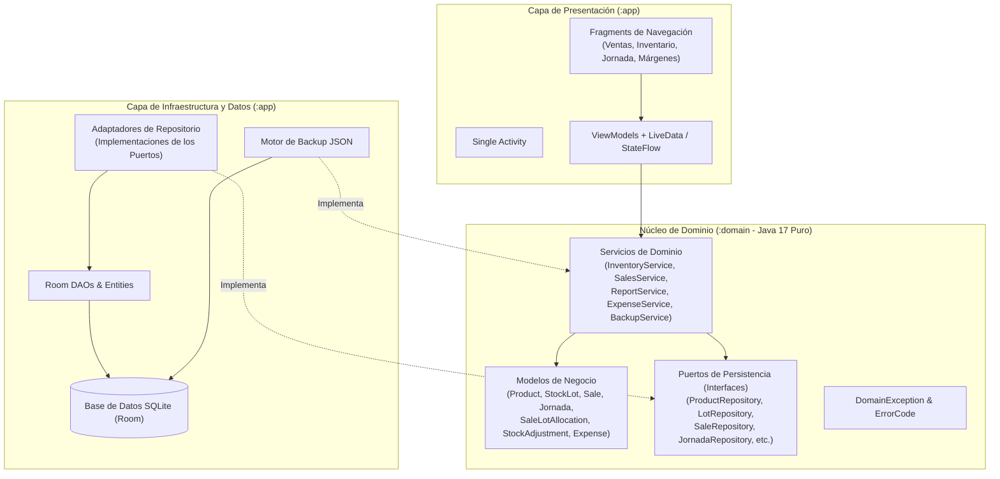
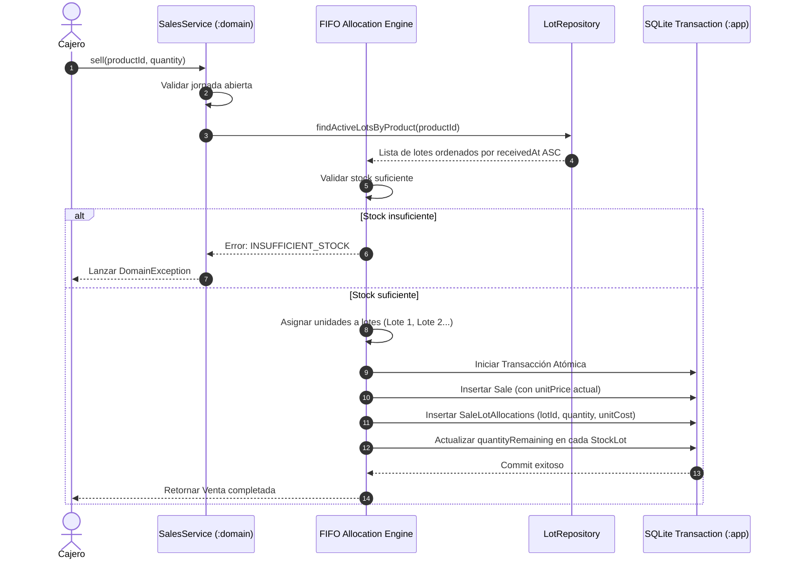
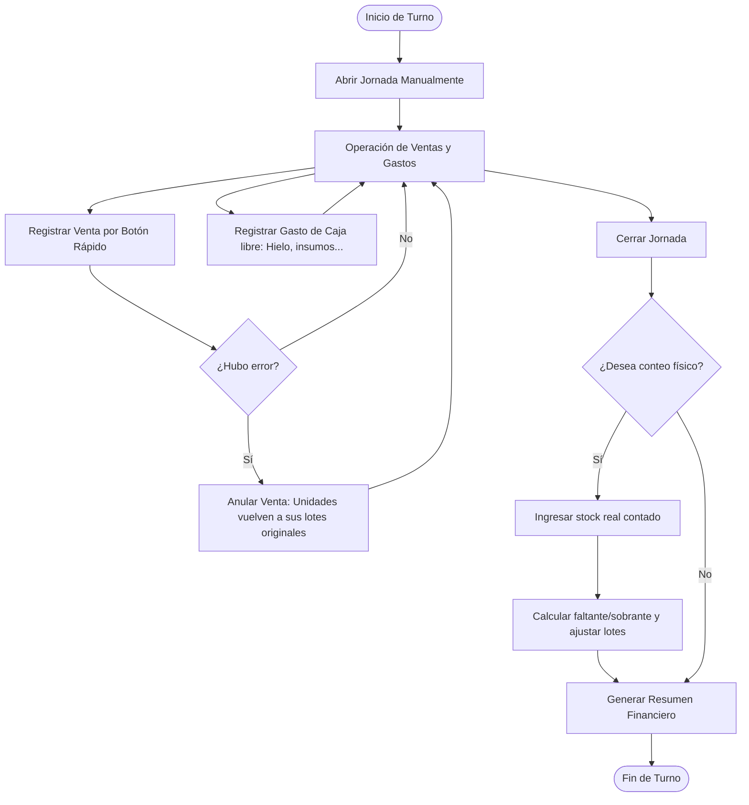
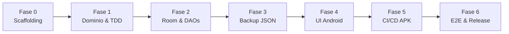

# Arquitectura de Software, Estrategia de Escalabilidad y Plan de Desarrollo
## Proyecto: Inventario Pool (Android Native APK)

---

## 1. Visión General del Proyecto

**Inventario Pool** es una aplicación **Android nativa en Java 17** empaquetada como archivo **`.apk`**, concebida para la gestión integral de **inventario** y **control financiero** de un bar con mesas de pool en Colombia.

### Restricciones Críticas de Entorno y Operación
* **100% Offline-First:** La app opera de forma completamente autónoma en el dispositivo móvil sin requerir conectividad a internet.
* **Operación a Una Mano y Poca Luz:** Interfaz optimizada para el contexto de barra/caja nocturna, con botones táctiles grandes, alto contraste y formatos numéricos colombianos sin decimales (`es-CO`, ej. `$180.000`).
* **Integridad Financiera:** Moneda en números enteros (`long` en pesos COP), inmutabilidad de precios históricos, asignación de lotes por FIFO real (sin promedios) y transacciones atómicas de base de datos.
* **Entrega Continua del APK:** El entregable ejecutable se compila a través de GitHub Actions con firma criptográfica persistente.

---

## 2. Arquitectura de Software y Principios de Escalabilidad

Para que la aplicación soporte requerimientos futuros sin necesidad de reescribir la lógica central, se implementa una **Arquitectura Limpia (Hexagonal / Puertos y Adaptadores)**.

### Factores Clave de Escalabilidad

> [!NOTE] Desacoplamiento Tecnológico Absoluto
> El módulo `:domain` no contiene ninguna referencia a `android.*`, `androidx.*` ni a Room. Es una librería Java estándar. Esto permite ejecutar pruebas unitarias a alta velocidad y reemplazar la base de datos sin alterar las reglas de negocio.

1. **Escalabilidad hacia la Nube (Sincronización Firebase / Supabase):**
   * Todas las entidades manejan marcas de tiempo UTC (`Instant`) y campos de trazabilidad.
   * Si en el futuro se añade sincronización multi-dispositivo, solo se crea un nuevo adaptador de sincronización en `:app` que escuche los eventos del repositorio, sin tocar el dominio.
2. **Escalabilidad Multiusuario y Control de Empleados:**
   * La entidad `AuditLog` registra cambios de estado (`beforeJson` / `afterJson`).
   * El modelo está preparado para adjuntar un `userId` opcional sin alterar los contratos existentes.
3. **Escalabilidad de Productos y Combos:**
   * El modelo `Product` desacopla el control de inventario mediante `tracksStock` (booleano).
   * La cerveza tradicional y la cerveza pool se tratan como productos independientes, lo que permite agregar a futuro productos compuestos (combos) como una relación 1:N de ingredientes o productos simples.
4. **Múltiples Métodos de Pago:**
   * Aunque hoy se cobra en efectivo al instante, las ventas pueden extenderse para aceptar un atributo `PaymentMethod` (Efectivo, Nequi, Daviplata, Tarjeta) sin impactar el motor FIFO.

---

## 3. Lógica Financiera y Motor FIFO

El cálculo de ganancias no utiliza promedios ponderados. Cada unidad vendida descuenta del lote más antiguo disponible y congela su costo de compra original.

### Fórmulas de Negocio Implementadas

| Métrica | Fórmula | Descripción |
|---|---|---|
| **Ganancia por Unidad** | $\text{Ganancia} = \text{Precio Venta} - \text{Costo Unitario Lote}$ | Margen neto en pesos de la unidad vendida de ese lote específico. |
| **Margen sobre Venta** | $\text{Margen}_V = \frac{\text{Precio Venta} - \text{Costo Lote}}{\text{Precio Venta}}$ | Porcentaje de ganancia respecto al dinero que entra en caja. |
| **Margen sobre Costo** | $\text{Margen}_C = \frac{\text{Precio Venta} - \text{Costo Lote}}{\text{Costo Lote}}$ | Rentabilidad obtenida sobre el capital invertido en ese lote. |
| **Ganancia Real Acumulada** | $\sum (\text{unitPrice} - \text{unitCost}) \times \text{cantidad}$ | Suma de ganancias reales de todas las asignaciones no anuladas. |
| **Comparación Costo Nuevo** | $\sum (\text{unitPrice} - \text{costoLoteMasReciente}) \times \text{cantidad}$ | Simulación de ganancia si todo se hubiese comprado al precio del último lote. |
| **Diferencial de Compra** | $\text{Ganancia Costo Nuevo} - \text{Ganancia Real}$ | Indica cuánto dejó de ganar el dueño por haber vendido mercancía comprada cara. |

---

## 4. Ciclo Operativo de una Jornada

---

## 5. Plan de Desarrollo Paso a Paso

### Fase 0: Scaffolding y Contratos Base
1. Configuración de proyecto multi-módulo Gradle (`settings.gradle`, `build.gradle` raíz, `:domain`, `:app`) con Java 17.
2. Definición de `.gitignore` excluyendo archivos de build, keystores y credenciales.
3. Creación de entidades inmutables y Value Objects en `:domain`.
4. Definición de las 5 interfaces de servicio (`InventoryService`, `SalesService`, `ReportService`, `ExpenseService`, `BackupService`) y las interfaces de repositorio (puertos).
5. Catálogo de excepciones (`DomainException`, `ErrorCode`).

### Fase 1: Motor de Dominio y Pruebas Unitarias (TDD)
1. Escritura de la suite de pruebas unitarias con JUnit 5 validando los casos obligatorios de negocio:
   * **Caso A:** Doble lote Águila, venta combinada, ganancia \$34.200, diferencia \$16.800 y porcentajes.
   * **Caso B:** Cerveza Águila Pool vs. Juego Pool sin stock.
   * **Caso C:** Anulación con devolución íntegra a lotes.
   * **Caso D:** Rechazo por stock insuficiente.
   * **Caso E:** Ajuste por conteo con faltante (-2 botellas) valorado al costo y a la venta.
   * **Caso F:** Inmutabilidad de precios ante cambios de catálogo.
   * **Caso G:** Control de jornadas (única jornada abierta y ventas bloqueadas sin jornada).
2. Implementación de los servicios de dominio hasta que el 100% de las pruebas pase en verde.

### Fase 2: Persistencia con Room y Transaccionalidad
1. Creación de entidades Room con claves foráneas e índices.
2. TypeConverters para `Instant`, `LocalDate`, etc.
3. DAOs con métodos `@Transaction` para garantizar atomicidad en operaciones compuestas.
4. Implementación de los adaptadores de repositorio conectando Room con los puertos de `:domain`.
5. Pruebas de integración de base de datos en memoria (`inMemoryDatabaseBuilder`).

### Fase 3: Motor de Respaldo y Caso H
1. Serializador y deserializador JSON estructurado con control de versiones.
2. Verificación transaccional: Exportar $\to$ vaciar BD $\to$ importar $\to$ verificar integridad referencial de todos los registros (**Caso H**).

### Fase 4: Capa de Presentación Android (`:app`)
1. Implementación de Single-Activity y Navigation Component con Fragments.
2. Diseño UI nocturno: tema oscuro, alto contraste, controles táctiles grandes.
3. Formato numérico estricto en pesos colombianos (`es-CO`).
4. Implementación de pantallas:
   * *Panel de Inicio:* Apertura, cierre y reapertura de jornada.
   * *Panel de Ventas:* Cuadrícula por categorías, incremento con 1 toque, long-press para cantidad manual, botón de anulación.
   * *Panel de Inventario:* Lista de productos, modal de entrada de mercancía con cantidad y precio de compra unitario obligatorio.
   * *Panel de Márgenes:* Vista de lotes, ganancia unitaria, margen sobre venta, margen sobre costo y análisis comparativo.
   * *Panel de Dinero:* Resumen de ventas, costo de mercancía, ganancia y registro de gastos de caja.
   * *Panel de Cierre:* Conteo físico opcional y confirmación.
   * *Panel de Respaldo:* Exportación/importación con *Storage Access Framework*.

### Fase 5: Pipeline CI/CD y Generación del APK Release
1. Creación de workflow de GitHub Actions (`.github/workflows/android.yml`).
2. Configuración de firma con Keystore persistente alojado en GitHub Secrets (`KEYSTORE_BASE64`, `KEYSTORE_PASSWORD`, etc.).
3. Generación y almacenamiento del artefacto `app-release.apk` en cada push a `main`.

### Fase 6: Pruebas End-to-End y Validación
1. Simulación del ciclo completo de una jornada real en emulador y dispositivo Android físico.
2. Verificación de estabilidad ante pérdida de proceso y reinicio de la app.

---

## 6. Riesgos Críticos y Salvaguardas

> [!WARNING] Firma Criptográfica Persistente (Keystore)
> La llave de firma del APK nunca debe regenerarse entre actualizaciones. Si la llave cambia, Android obligará al usuario a desinstalar la app para actualizarla, lo cual **eliminará la base de datos local SQLite y destruirá todo el historial financiero del negocio**. La llave debe resguardarse de forma segura fuera del repositorio y cargarse vía GitHub Secrets.

> [!IMPORTANT] Moneda Entera
> Bajo ninguna circunstancia se deben utilizar tipos de punto flotante (`float`, `double`) para almacenar dinero o calcular costos. Todo monto financiero se procesa como `long` en pesos colombianos enteros.
